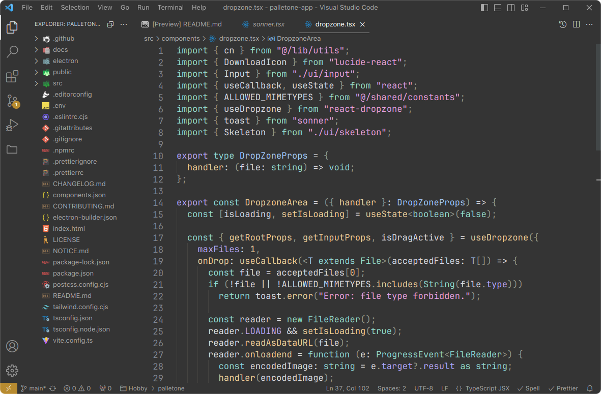
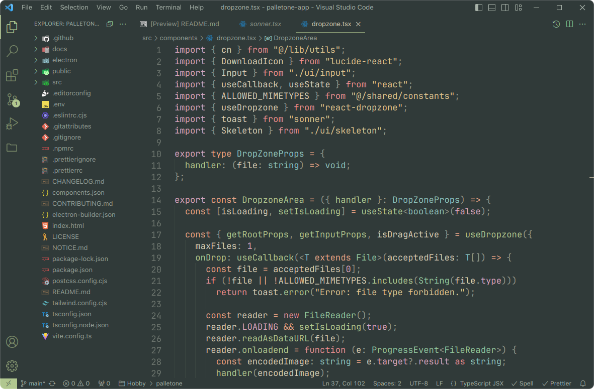
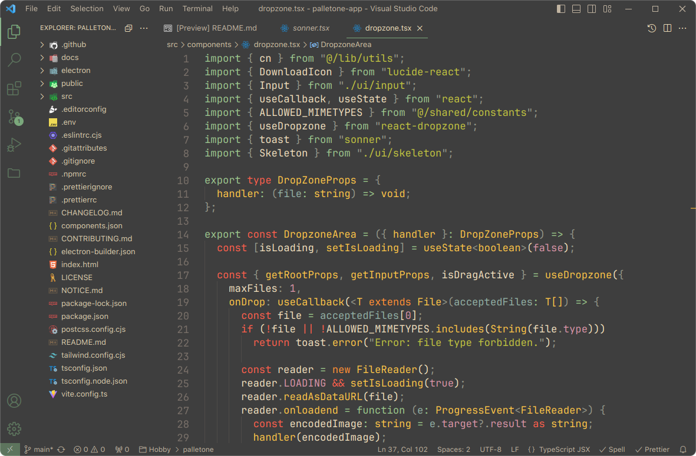
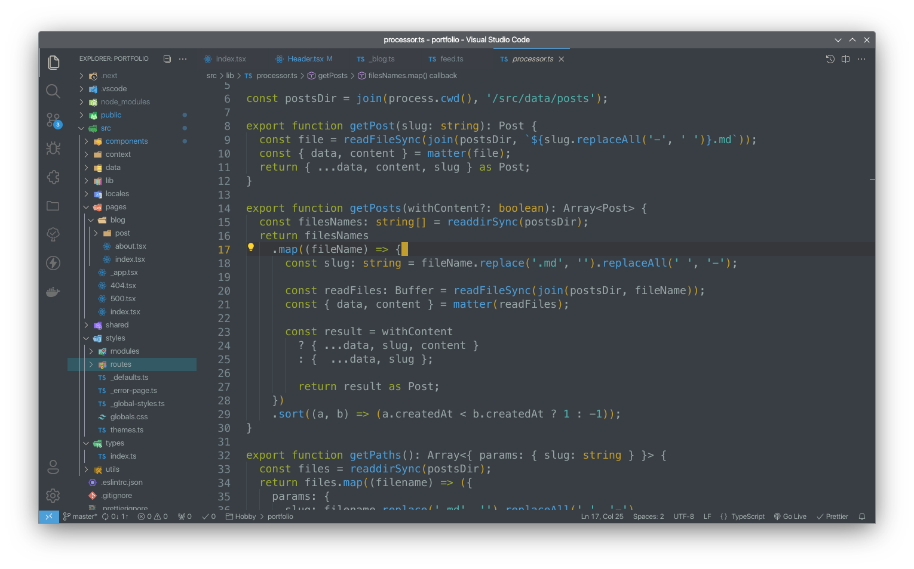
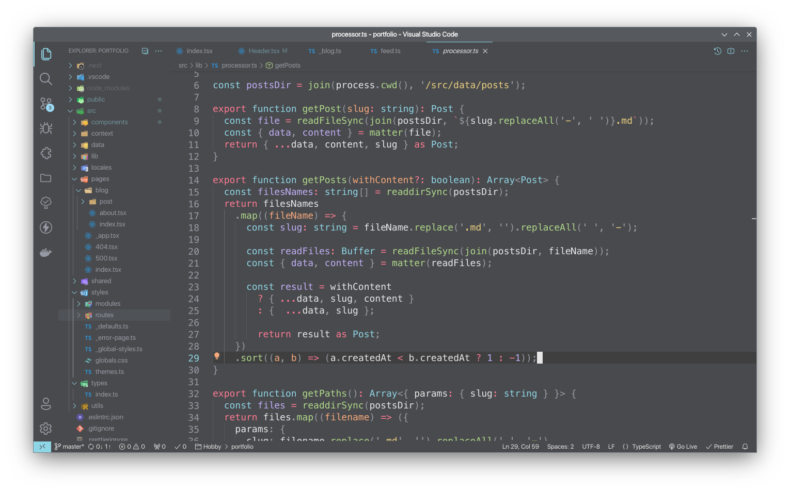
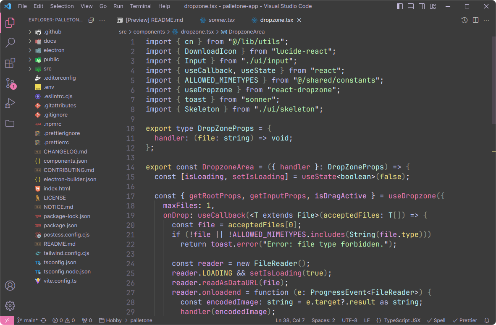
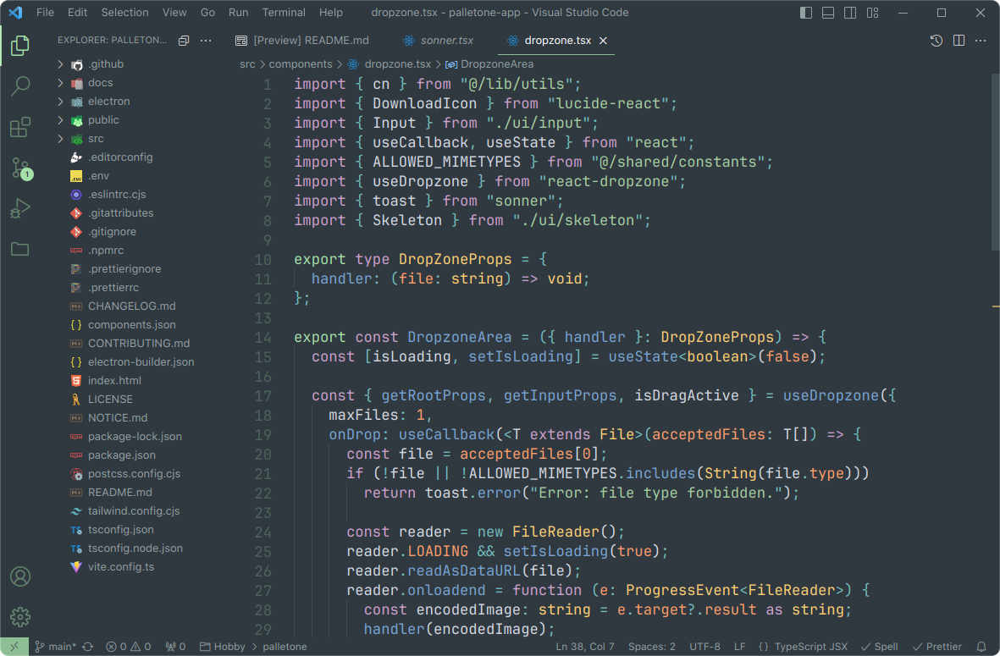
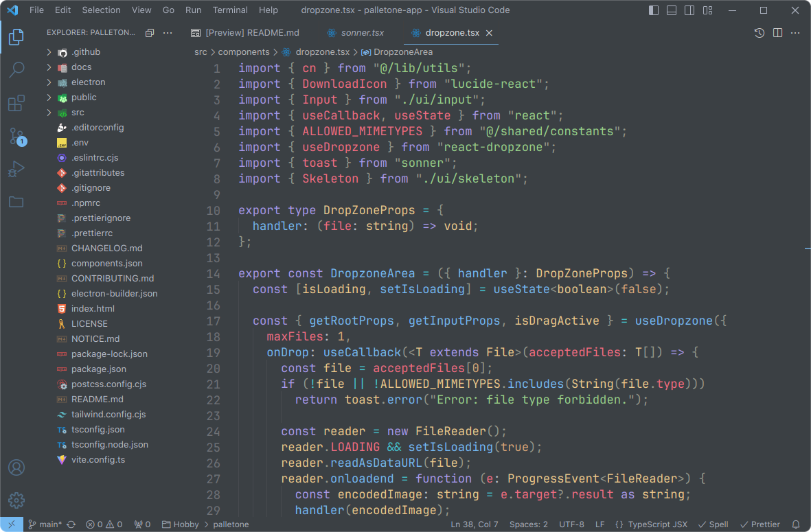
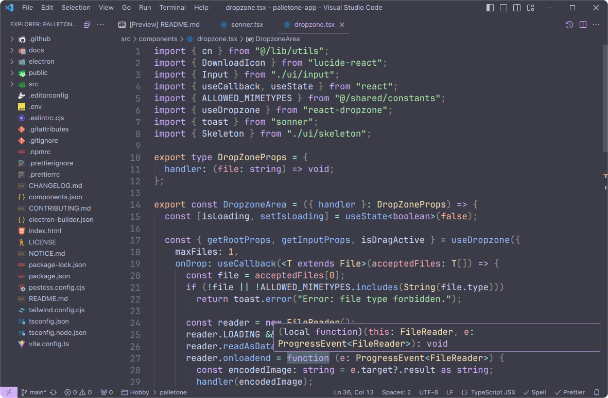

<h1 align="center">
 🎉💖 Maron Themes for VS Code.
</h1>

<p align="center">
    <a href="https://github.com/KainNhantumbo/maron-themes" alt="Mozambique Message">
        </a>
</p>

<p align="center">
    <a href="https://marketplace.visualstudio.com/items?itemName=KainNhantumbo.maron-themes" alt="Marketplace">
        </a>
    <a href="https://github.com/KainNhantumbo/maron-themes" alt="Repository">
        </a>
    <a href="https://github.com/KainNhantumbo/maron-themes/issues" alt="Issues">
        </a>
    <a href="https://vscode.dev/theme/KainNhantumbo.maron-themes" alt="Preview">
        </a>
</p>

> 🪂 Bring new look and feel to your [Visual Studio Code](https://code.visualstudio.com) 🤩

A set of themes that contains consistent highlighting. Each theme uses no or less italics, underscores, bold, etc. for code and editor.

I optimized these themes to be fully compatible with blur or transparency window effects that you can get using vibrancy or [vscode-blur-linux](https://marketplace.visualstudio.com/items?itemName=mhabrar.vscode-blur-linux) (makes the vscode background blurry in KDE Plasma linux distros).

Feel free use, reuse and fork.\
Get the source code here: [https://github.com/KainNhantumbo/maron-themes](https://github.com/KainNhantumbo/maron-themes)

You can install this awesome theme pack through the [Visual Studio Code Marketplace](https://marketplace.visualstudio.com/items?itemName=KainNhantumbo.maron-themes).

### 📷🥰 Here are some preview screenshots!

|           Maron Fleet             |            Maron Forest           |
| :-------------------------------: | :-------------------------------: |
|  |  |

|          Maron Gruvbox            |           Maron Kanagawa          |
| :-------------------------------: | :-------------------------------: |
|  |  |

|          Maron Nord               |           Maron Solarized         |
| :-------------------------------: | :-------------------------------: |
|  |  |

|          Maron Rosetta            |           Maron Oceanic           |
| :-------------------------------: | :-------------------------------: |
|  |  |

|          Maron Atom               |           Maron Catppuccin        |
| :-------------------------------: | :-------------------------------: |
|  |  |

### 🚀 Installation

Launch Quick Open:

- Linux Ctrl+P
- macOS ⌘P
- Windows Ctrl+P

Then paste the following command and press Enter:

```bash
ext install KainNhantumbo.maron-themes
```

Activate theme
Launch Quick Open:

- Linux Ctrl + Shift + P
- macOS ⌘ + Shift + P
- Windows Ctrl + Shift + P

Type theme, choose `Preferences: Color Theme`, and select one of the **Maron Themes** variants from the list. Well done!

### ⛵ Override Theme Colors

You can override the **Maron Themes** and schemes colors by adding theme-specific settings to your configuration. For advanced customisation please check the relative section on the [VS Code documentation](https://code.visualstudio.com/docs/getstarted/themes#_customizing-a-color-theme).

Recommended settings that I use for a better experience:

```json
{
  // Controls the font family.
  "editor.fontFamily": "0xProto",

  // Controls the line height. Use 0 to compute the lineHeight from the fontSize.
  "editor.lineHeight": 24,

  // Enables font ligatures
  "editor.fontLigatures": true,

  // Controls if file decorations should use badges.
  "explorer.decorations.badges": false,

  // cursor customizations
  "editor.cursorBlinking": "phase",
  "editor.cursorSmoothCaretAnimation": "on",
  "terminal.integrated.cursorStyle": "block",
  "editor.cursorStyle": "block"
}
```

### 🥳 Credits

I like to express my "Special Thanks" to:\
All contributors that this extension is based with, it would not be what it is without them.

### 🦄 Inspiration

- [Catppuccin](https://marketplace.visualstudio.com/items?itemName=Catppuccin.catppuccin-vsc)
- [Dracula](https://marketplace.visualstudio.com/items?itemName=dracula-theme.theme-dracula)
- [Code Sandbox](https://marketplace.visualstudio.com/items?itemName=CodeSandbox-io.codesandbox-projects-theme)
- [Darkbox](https://marketplace.visualstudio.com/items?itemName=bottledlactose.darkbox)
- [Everforest](https://marketplace.visualstudio.com/items?itemName=sainnhe.everforest)
- [JetBrains Fleet Dark](https://marketplace.visualstudio.com/items?itemName=franzgollhammer.jb-fleet-dark)
- [Github Theme](https://marketplace.visualstudio.com/items?itemName=github.theme)
- [HardHacker Theme](https://marketplace.visualstudio.com/items?itemName=HardHacker.hard-hacker-theme)
- [Kanagawa Black](https://marketplace.visualstudio.com/items?itemName=Lamarcke.kanagawa-black)
- [Material](https://marketplace.visualstudio.com/items?itemName=Equinusocio.vsc-material-theme)
- [Nord](https://marketplace.visualstudio.com/items?itemName=arcticicestudio.nord-visual-studio-code)
- [One Dark Pro](https://marketplace.visualstudio.com/items?itemName=zhuangtongfa.material-theme)
- [Ocean Theme](https://marketplace.visualstudio.com/items?itemName=alanlang.theme-ocean)
- [Solarized Dark Vim](https://marketplace.visualstudio.com/items?itemName=hkmix.solarized-dark-vim)
- [Sonokai](https://marketplace.visualstudio.com/items?itemName=sainnhe.sonokai)
- [Tokyo Night](https://marketplace.visualstudio.com/items?itemName=enkia.tokyo-night)

Something's missing? Create Issues so that I can make the theme as compatible as possible ! ❤️ ;)

## ☘️ Find me!

E-mail: [nhantumbok@gmail.com](nhantumbok@gmail.com 'Send an e-mail')\
Github: [https://github.com/KainNhantumbo](https://github.com/KainNhantumbo 'See my github profile')
Portfolio: [https://codenut-dev.vercel.app/en/](https://codenut-dev.vercel.app/en/ 'See my portfolio website')\
My Blog: [https://codenut-dev.vercel.app/en/blog](https://codenut-dev.vercel.app/en/blog 'Visit my blog site')

#### If you like this project, let me know by leaving a star on this repository so I can keep improving this extension.😊😘

Best regards, Kain Nhantumbo.\
✌️🇲🇿 **Made for Visual Studio Code**

## 📜 License

This theme pack extension is released under the MIT License.\
Copyright &copy; 2023 Kain Nhantumbo.

> Refer to the [notice file](./NOTICE.md) for more information.
