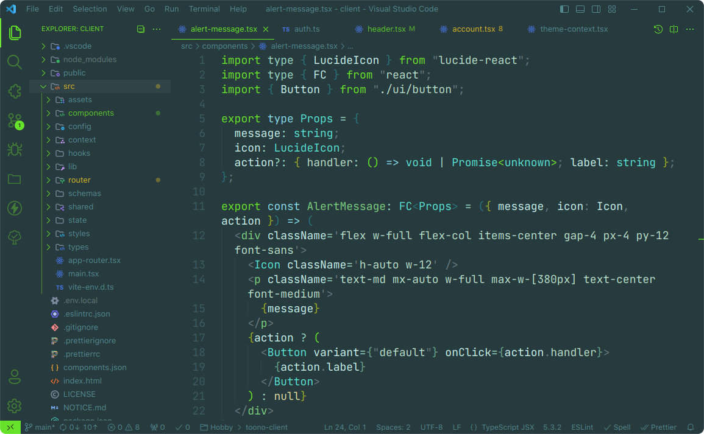
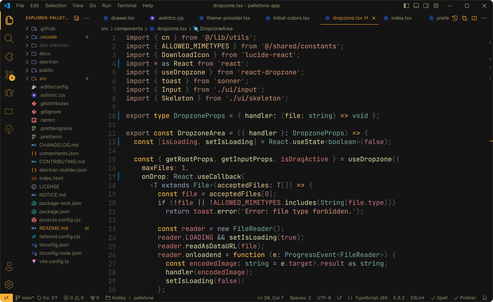
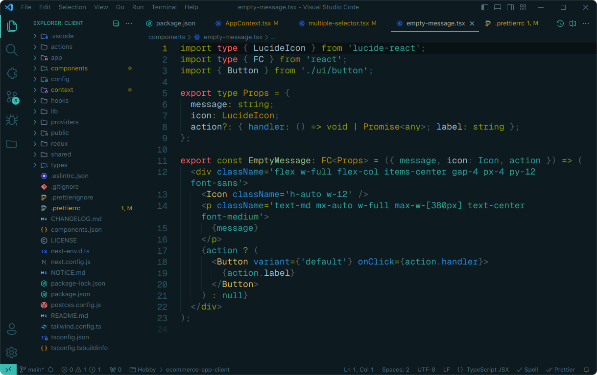

<h1 align="center">
 🎉💖 Maron Themes for VS Code.
</h1>

<p align="center">
    <a href="https://github.com/KainNhantumbo/maron-themes" alt="Mozambique Developer Message">
        </a>
</p>

<p align="center">
    <a href="https://marketplace.visualstudio.com/items?itemName=KainNhantumbo.maron-themes" alt="Marketplace">
        </a>
    <a href="https://github.com/KainNhantumbo/maron-themes" alt="Repository">
        </a>
    <a href="https://github.com/KainNhantumbo/maron-themes/issues" alt="Issues">
        </a>
    <a href="https://vscode.dev/theme/KainNhantumbo.maron-themes" alt="Preview">
        </a>
</p>

<p style="text-align:center">Please support this project, by buying a coffee ☕️ to the developer 👉👈</p>

<div style="text-align:center;">
  <a href="https://buymeacoffee.com/nhantumboku" style="display:inline-block;">
    
  </a>
</div>

> 🪂 Bring new look and feel to your [Visual Studio Code](https://code.visualstudio.com) 🤩
>
> This is a pack of themes that contains consistent highlighting and better **UI Look n' Feel** motion for coding and markdown editing.\
> Each theme uses no or less italics, underscores, bold, etcetera, leaving only what needed for semantic purposes (except for newly custom "operator" labeled themes, which contain italicizations).

I designed all themes to be compatible with blur or window transparency effects that you can get using vibrancy or [vscode-blur-linux](https://marketplace.visualstudio.com/items?itemName=mhabrar.vscode-blur-linux) (makes the vscode background blurry in KDE Plasma linux distros).

> 🪁 Learn more in this comprehensive (and funny) [changelog](./CHANGELOG.md).

Feel free to use, reuse and fork.\
Get the source code here: [https://github.com/KainNhantumbo/maron-themes](https://github.com/KainNhantumbo/maron-themes)

Also, you can install this awesome theme pack through the [Visual Studio Code Marketplace](https://marketplace.visualstudio.com/items?itemName=KainNhantumbo.maron-themes).

> This project is currently receiving updates and patches so you don't really want to miss out!

> 🪁 **Just a slice of 28 colorful theme flavors! I bet you will like it.**

<figure align="center">



<figcaption align="center">Maron Soul Reaper! (ORIGINAL PALETTE)</figcaption>
</figure>

<figure align="center">



<figcaption align="center">Maron Origins Pro! (ORIGINAL PALETTE)</figcaption>
</figure>

<figure align="center">



<figcaption align="center">Maron Solarized Planets! (SOLARIZED PALETTE)</figcaption>
</figure>

## 🚀 Installation

👏 Launch Quick Open:

- Linux **Ctrl+P**
- macOS **⌘P**
- Windows **Ctrl+P**

Then paste the following command and press **Enter**:

```bash
ext install KainNhantumbo.maron-themes
```

👏 To Activate theme, launch Quick Open:

- Linux **Ctrl + Shift + P**
- macOS **⌘ + Shift + P**
- Windows **Ctrl + Shift + P**

Type **_theme_**, choose `Preferences: Color Theme`, and select one of the **Maron Themes** variants from the list. Well done!

## ⛵ Override Theme Colors

You can override the **Maron Themes** and schemes colors by adding theme-specific settings to your configuration. For advanced customisation please check the relative section on the [VS Code documentation](https://code.visualstudio.com/docs/getstarted/themes#_customizing-a-color-theme).

Recommended settings I use for better experience:

```json
{
  // Controls the font family (you can get those on https://nerdfonts.com).
  "editor.fontFamily": "JetBrainsMono Nerd Font Mono, IBM Plex Mono, Geist Mono",
  // Controls the line height. Use 0 to compute the lineHeight from the fontSize.
  "editor.lineHeight": 24,
  // Enables font ligatures
  "editor.fontLigatures": false,
  // cursor customizations
  "editor.cursorBlinking": "phase",
  "editor.cursorSmoothCaretAnimation": "on",
  "terminal.integrated.cursorStyle": "block",
  "editor.bracketPairColorization.enabled": true,
  "editor.cursorStyle": "block"
}
```

Since version 1.6.0, tab bar color position changed to bottom instead of the top. If you prefer the _'old style'_, add the these lines below to your editor configuration file:

```json
"workbench.colorCustomizations": {
    // you can change this color to whatever you want
   "tab.activeBorderTop": "#ffffff80",
    // leave "as is" here to maintain bottom color invisible
   "tab.activeBorder": "#00000000"
  },
```

### 🥳 Credits

I like to express my "Special Thanks" to:\
All contributors that this extension is based with, it would not be what it is without them.

### 🦄 Inspiration

- [Catppuccin](https://marketplace.visualstudio.com/items?itemName=Catppuccin.catppuccin-vsc)
- [Copilot Theme](https://marketplace.visualstudio.com/items?itemName=benjaminbenais.copilot-theme)
- [Dracula](https://marketplace.visualstudio.com/items?itemName=dracula-theme.theme-dracula)
- [Code Sandbox](https://marketplace.visualstudio.com/items?itemName=CodeSandbox-io.codesandbox-projects-theme)
- [Darkbox](https://marketplace.visualstudio.com/items?itemName=bottledlactose.darkbox)
- [Everforest](https://marketplace.visualstudio.com/items?itemName=sainnhe.everforest)
- [JetBrains Fleet Dark](https://marketplace.visualstudio.com/items?itemName=franzgollhammer.jb-fleet-dark)
- [Github Theme](https://marketplace.visualstudio.com/items?itemName=github.theme)
- [Halcyon Theme](https://marketplace.visualstudio.com/items?itemName=brittanychiang.halcyon-vscode)
- [HardHacker Theme](https://marketplace.visualstudio.com/items?itemName=HardHacker.hard-hacker-theme)
- [Kanagawa Black](https://marketplace.visualstudio.com/items?itemName=Lamarcke.kanagawa-black)
- [Material](https://marketplace.visualstudio.com/items?itemName=Equinusocio.vsc-material-theme)
- [Night Owl](https://marketplace.visualstudio.com/items?itemName=sdras.night-owl)
- [Nord](https://marketplace.visualstudio.com/items?itemName=arcticicestudio.nord-visual-studio-code)
- [One Dark Pro](https://marketplace.visualstudio.com/items?itemName=zhuangtongfa.material-theme)
- [Ocean Theme](https://marketplace.visualstudio.com/items?itemName=alanlang.theme-ocean)
- [React Theme](https://marketplace.visualstudio.com/items?itemName=MoonHealth.react-theme-faithful)
- [Slime Theme](https://marketplace.visualstudio.com/items?itemName=smlombardi.slime)
- [Solarized Dark Vim](https://marketplace.visualstudio.com/items?itemName=hkmix.solarized-dark-vim)
- [Sonokai](https://marketplace.visualstudio.com/items?itemName=sainnhe.sonokai)
- [Tailwind Theme](https://marketplace.visualstudio.com/items?itemName=WollaceBuarque.tailwind-theme)
- [Tokyo Night](https://marketplace.visualstudio.com/items?itemName=enkia.tokyo-night)
- [Vitesse Theme](https://marketplace.visualstudio.com/items?itemName=antfu.theme-vitesse)

Something's missing? Create Issues so that I can make the each theme compatible as possible! ❤️ ;)

## ☘️ Find me!

**E-mail:** [nhantumbok@gmail.com](nhantumbok@gmail.com 'Send an e-mail')\
**Github:** [https://github.com/KainNhantumbo](https://github.com/KainNhantumbo 'See my github profile')\
**Portfolio:** [https://codenut-dev.vercel.app/en](https://codenut-dev.vercel.app/en 'See my portfolio website')\
**My Blog:** [https://codenut-dev.vercel.app/en/blog](https://codenut-dev.vercel.app/en/blog 'Visit my blog site')

**If you like this project, let me know by leaving a star on this repository so I can keep improving this extension.😊😘**

Best regards, Kain Nhantumbo.\
✌️🇲🇿 **Made for Visual Studio Code**

## 🎒 Changelog

See all changes documented on this awesome changelog right [here](./CHANGELOG.md).

## 📜 License

This theme pack extension is released under the MIT License.\
Copyright &copy; 2024 Kain Nhantumbo.

> Refer to the [notice file](./NOTICE.md) for more information.
